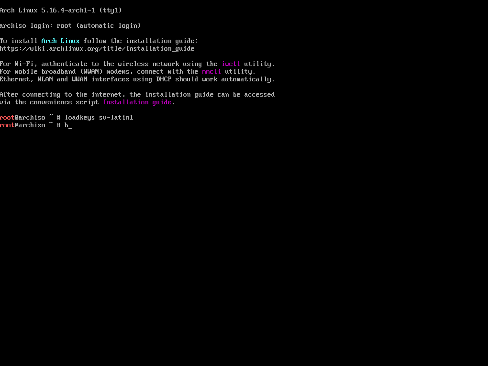

# Arch Linux Install Helper (EFI)

## TL;DR:

Just run:
`bash <(curl -s https://raw.githubusercontent.com/helmesjo/arch-install/main/install.sh)`

## Customization hook
In the [pre-step](https://github.com/helmesjo/arch-install/blob/65c660bb3e13a03bad2d0a848f3232a2c7791df4/install.sh#L71-L119), one can [supply a url](https://github.com/helmesjo/arch-install/blob/65c660bb3e13a03bad2d0a848f3232a2c7791df4/install.sh#L102-L104) to a git repository of choice that contains a `setup.sh` script at root level. During installation this script will be exected, and any custom setup can be done.

The script will be executed as the specified user with [`NOPASS`](https://github.com/helmesjo/arch-install/blob/65c660bb3e13a03bad2d0a848f3232a2c7791df4/install.sh#L333-L352), so `sudo` can be run without having to halt the installation with a password prompt. See example script [here](https://github.com/helmesjo/dotfiles/blob/45f556d75bb3f448752ed141867c0035e17713bd/setup.sh).
